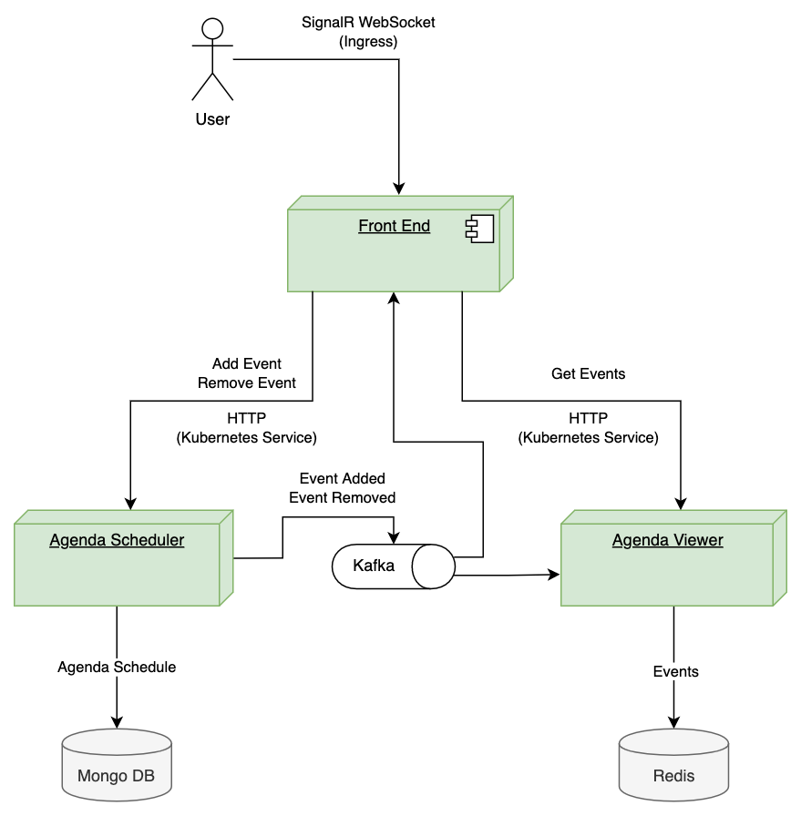
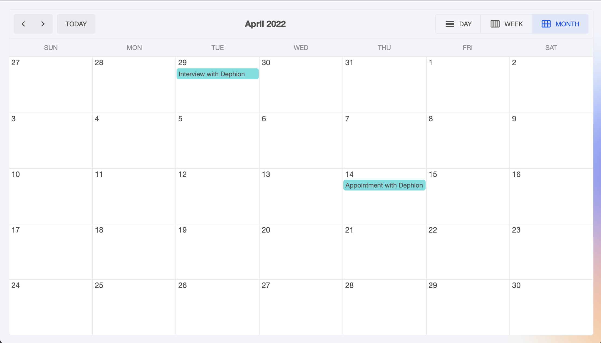
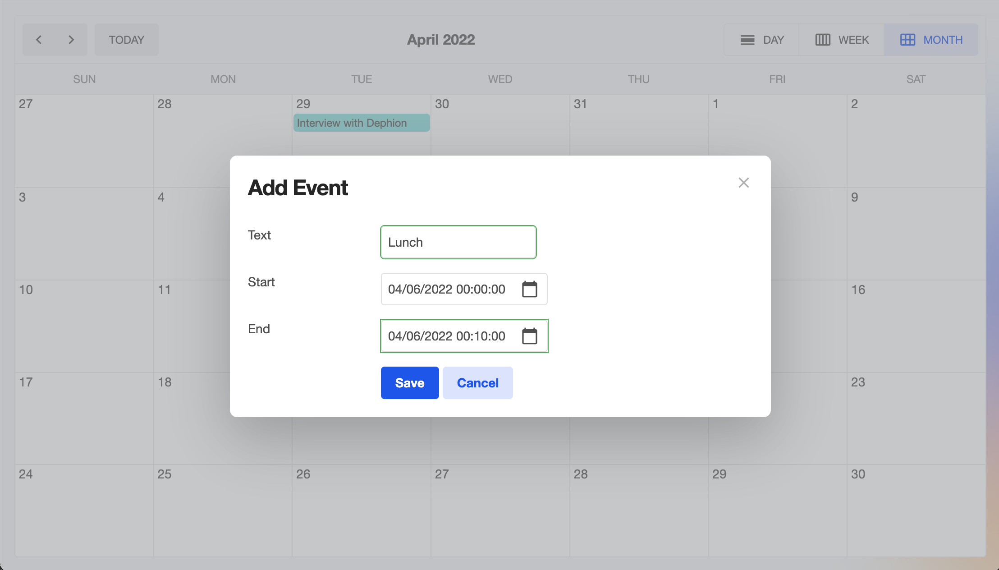
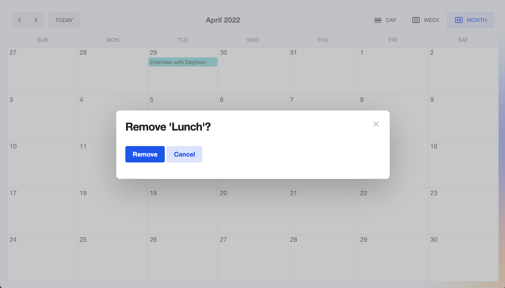

# .NET Core, Blazor Server, Kafka, Redis and Mongo on Kubernetes

[](https://github.com/nikitadmitry/calendar/actions/workflows/agenda-scheduler-workflow.yaml)
[](https://github.com/nikitadmitry/calendar/actions/workflows/agenda-viewer-workflow.yaml)
[](https://github.com/nikitadmitry/calendar/actions/workflows/front-end-workflow.yaml)

Demo might be available [Here](https://bezdelnik.by/calendar)

### Business Requirements
This is a simple calendar app.

You can schedule something with a name, start date/time and end date/time.

It's not allowed to have an overlapping schedule, and it's not allowed to span over multiple days.

### Technical Requirements
- Use of Kubernetes
- Use of CQRS
- Agenda Viewer service: 2 replica's
- Agenda Scheduler service: 2 replica's
- Front End to view calendar and make schedules (does not have to be pretty, just functional): 1 replica
- Some Unit tests (Check them out [here](https://github.com/nikitadmitry/calendar/tree/master/agenda-scheduler/Calendar.AgendaScheduler.Domain.Tests))

## Architecture diagram



## Prerequisites

This application requires you to have the following installed on your machine:

- Kubernetes CLI [kubectl](https://kubernetes.io/docs/tasks/tools/install-kubectl/)
- Kubernetes cluster, such as [Minikube](https://docs.dapr.io/operations/hosting/kubernetes/cluster/setup-minikube/) or [Docker Desktop](https://www.docker.com/products/docker-desktop)
- Helm [Installing Helm](https://helm.sh/docs/intro/install/)

## Step 1 - Create Docker Images

The first thing to do is to build the applications into Docker
```
docker build -f ./agenda-viewer/Calendar.AgendaViewer.WebApi/Dockerfile -t calendar/agenda-viewer:1.0.0 .
docker build -f ./agenda-scheduler/Calendar.AgendaScheduler.WebApi/Dockerfile -t calendar/agenda-scheduler:1.0.0 .
docker build -f ./front-end/Calendar.WebApp/Dockerfile -t calendar/front-end:1.0.0 .
```

## Step 2 - Setup the Dependencies

The application utilizes Apache Kafka, Redis and MongoDB.
The easiest way to setup those on your Kubernetes cluster is by using [Helm](https://helm.sh/) package manager. To install Helm on your development machine follow this [guide](https://helm.sh/docs/intro/install/).

```
helm repo add bitnami https://charts.bitnami.com/bitnami
helm upgrade --install calendar-redis-release bitnami/redis --namespace=calendar
helm upgrade --install calendar-mongodb-release bitnami/mongodb --namespace=calendar
helm upgrade --install calendar-kafka-release bitnami/kafka --namespace=calendar
```

Based on configuration Kafka, it might be required to manually create the topics:
```
kubectl exec -n=calendar --tty -i calendar-kafka-release-0 -- kafka-topics.sh --bootstrap-server localhost:9092 --topic scheduler_event_added --partitions 2 --create
kubectl exec -n=calendar --tty -i calendar-kafka-release-0 -- kafka-topics.sh --bootstrap-server localhost:9092 --topic scheduler_event_removed --partitions 2 --create
```

To verify the installation of Kafka and Redis run `kubectl get service | grep -e kafka -e redis -e mongo` and you should see similiar output:

```
calendar-kafka-release                      ClusterIP   10.107.76.160    <none>        9092/TCP                     30m
calendar-kafka-release-headless             ClusterIP   None             <none>        9092/TCP,9093/TCP            30m
calendar-kafka-release-zookeeper            ClusterIP   10.110.233.205   <none>        2181/TCP,2888/TCP,3888/TCP   30m
calendar-kafka-release-zookeeper-headless   ClusterIP   None             <none>        2181/TCP,2888/TCP,3888/TCP   30m
calendar-mongodb-release                    ClusterIP   10.98.228.134    <none>        27017/TCP                    160m
calendar-redis-release-headless             ClusterIP   None             <none>        6379/TCP                     160m
calendar-redis-release-master               ClusterIP   10.97.112.224    <none>        6379/TCP                     160m
calendar-redis-release-replicas             ClusterIP   10.104.147.27    <none>        6379/TCP                     160m
```

## Step 3 - Deploy .NET Core applications into Kubernetes

To deploy .NET Core applications make sure you are positioned in the right directory and then install the Helm Chart.
```
cd scripts/charts/calendar
helm upgrade --install calendar-release . \
    --namespace=calendar \
    --set agenda-viewer.image.tag="1.0.0" \
    --set agenda-scheduler.image.tag="1.0.0" \
    --set front-end.image.tag="1.0.0" \
    --set agenda-scheduler.env.MONGO__CREDENTIAL__PASSWORD=$(kubectl get secret --namespace "calendar" calendar-mongodb-release -o jsonpath="{.data.mongodb-root-password}" | base64 --decode) \
    --set agenda-viewer.env.REDIS__PASSWORD=$(kubectl get secret --namespace calendar calendar-redis-release -o jsonpath="{.data.redis-password}" | base64 --decode)
```

## Step 4 - Visit the UI

Navigate to `http://calendar.kube/` using a web browser.

Click on a spot to add an event.

Click on event and confirm to remove it. 

Feel free to try it with multiple tabs, it's real-time.

<details>
    <summary>Screenshots</summary>
    </img>
    </img>
    </img>
</details>

# Support Stuff

## Minikube issues

Docker images pull fails? Try running this `eval $(minikube docker-env)`.

Ingress dns resolution fails? Here is a [possible fix](https://minikube.sigs.k8s.io/docs/handbook/addons/ingress-dns/), but instead of a "test" domain use a "kube" domain.

## Apache Kafka client

To create a pod that you can use as a Kafka client run the following commands:

```
kubectl run calendar-kafka-release-client --restart='Never' --image docker.io/bitnami/kafka:3.1.0-debian-10-r64 --namespace calendar --command -- sleep infinity

kubectl exec --tty -i calendar-kafka-release-client --namespace calendar -- bash
```

PRODUCER:

```
kafka-console-producer.sh --broker-list calendar-kafka-release-headless:9092 --topic test
```

CONSUMER:

```
kafka-console-consumer.sh --bootstrap-server calendar-kafka-release:9092 --topic test --from-beginning
```

To delete all message from specific topic run command:

```
kafka-topics.sh --zookeeper calendar-kafka-release-zookeeper:2181 --alter --topic TOPIC_NAME --config retention.bytes=1
```

To read Kafka configuration value:
```
kafka-configs.sh --bootstrap-server calendar-kafka-release:9092 --all --describe --entity-type brokers | grep "auto.create.topics.enable"
```

## Redis client

To get your password run:

```
export REDIS_PASSWORD=$(kubectl get secret --namespace calendar calendar-redis-release -o jsonpath="{.data.redis-password}" | base64 --decode)
```

To connect to your Redis(TM) server:

1. Run a Redis(TM) pod that you can use as a client:

```
kubectl run --namespace calendar redis-client --rm --tty -i --restart='Never' \
    --env REDIS_PASSWORD=$REDIS_PASSWORD \
   --image docker.io/bitnami/redis:6.0.12-debian-10-r3 -- bash
```

2. Connect using the Redis(TM) CLI:

```
redis-cli -h redis-master -a $REDIS_PASSWORD
```

## Mongo client
To connect to your database, create a MongoDB&reg; client container:
```
kubectl run --namespace calendar calendar-mongodb-release-client --rm --tty -i --restart='Never' \
        --env="MONGODB_ROOT_PASSWORD=$MONGODB_ROOT_PASSWORD" --image docker.io/bitnami/mongodb:4.4.13-debian-10-r30 \
        --command -- bash
```

Then, run the following command:
```
mongo admin --host "calendar-mongodb-release" --authenticationDatabase admin -u root -p $MONGODB_ROOT_PASSWORD
```

To connect to your database from outside the cluster execute the following commands:
```
kubectl port-forward --namespace calendar svc/calendar-mongodb-release 27017:27017 &
    mongo --host 127.0.0.1 --authenticationDatabase admin -p $MONGODB_ROOT_PASSWORD
```

## Deploying to AKS

1. Create a cluster and a registry resources, enable `HTTP request routing`
2. Install Helm charts the same way, use less resources for dev/test (Config below fits into a single Standard B2s node)
```
helm upgrade --install calendar-redis-release bitnami/redis --set master.persistence.size=500Mi --set replica.persistence.size=500Mi --set architecture=standalone
helm upgrade --install calendar-mongodb-release bitnami/mongodb --set persistence.size=500Mi --set hidden.persistence.size=500Mi
helm upgrade --install calendar-kafka-release bitnami/kafka --set persistence.size=500Mi --set logPersistence.size=500Mi --set zookeeper.persistence.size=500Mi --set livenessProbe.initialDelaySeconds=60 --set readinessProbe.initialDelaySeconds=60 --set startupProbe.initialDelaySeconds=60
```
3. Get cluster DNS zone, from portal or cli, and save it into a variable `azure_cluster_zone`
```
azure_cluster_zone=$(az aks show --name <cluster name> --resource-group <resource group name> --query addonProfiles.httpApplicationRouting.config.HTTPApplicationRoutingZoneName -o tsv) 
```
4A. Using prebuild images. Install the apps
```
helm upgrade --install calendar-release . \
    --set agenda-viewer.image.tag="master" \
    --set agenda-scheduler.image.tag="master" \
    --set front-end.image.tag="master" \
    --set agenda-viewer.image.repository=ghcr.io/nikitadmitry/calendar/agenda-viewer \
    --set agenda-scheduler.image.repository=ghcr.io/nikitadmitry/calendar/agenda-scheduler \
    --set front-end.image.repository=ghcr.io/nikitadmitry/calendar/front-end \
    --set front-end.ingress.annotations."kubernetes\.io\/ingress\.class"=addon-http-application-routing \
    --set "front-end.ingress.hosts[0].host"=calendar-cluster.$azure_cluster_zone \
    --set "front-end.ingress.hosts[0].paths[0].path"="/" \
    --set "front-end.ingress.hosts[0].paths[0].pathType"=Prefix \
    --set agenda-scheduler.env.MONGO__CREDENTIAL__PASSWORD=$(kubectl get secret calendar-mongodb-release -o jsonpath="{.data.mongodb-root-password}" | base64 --decode) \
    --set agenda-viewer.env.REDIS__PASSWORD=$(kubectl get secret calendar-redis-release -o jsonpath="{.data.redis-password}" | base64 --decode)
```

4B. Building images from source. Push images into a registry
```
az acr build --file ./agenda-scheduler/Calendar.AgendaScheduler.WebApi/Dockerfile --registry <registry name> --image calendar/agenda-scheduler:1.0.0 .
az acr build --file ./agenda-viewer/Calendar.AgendaViewer.WebApi/Dockerfile --registry <registry name> --image calendar/agenda-viewer:1.0.0 .
az acr build --file ./front-end/Calendar.WebApp/Dockerfile --registry <registry name> --image calendar/front-end:1.0.0 .
```
5B. Install the apps
```
azure_registry_name=<azure cr name>

helm upgrade --install calendar-release . \
    --set agenda-viewer.image.tag="1.0.0" \
    --set agenda-scheduler.image.tag="1.0.0" \
    --set front-end.image.tag="1.0.0" \
    --set agenda-viewer.image.repository=$azure_registry_name/calendar/agenda-viewer \
    --set agenda-scheduler.image.repository=$azure_registry_name/calendar/agenda-scheduler \
    --set front-end.image.repository=$azure_registry_name/calendar/front-end \
    --set front-end.ingress.annotations."kubernetes\.io\/ingress\.class"=addon-http-application-routing \
    --set "front-end.ingress.hosts[0].host"=calendar-cluster.$azure_cluster_zone \
    --set "front-end.ingress.hosts[0].paths[0].path"="/" \
    --set "front-end.ingress.hosts[0].paths[0].pathType"=Prefix \
    --set agenda-scheduler.env.MONGO__CREDENTIAL__PASSWORD=$(kubectl get secret calendar-mongodb-release -o jsonpath="{.data.mongodb-root-password}" | base64 --decode) \
    --set agenda-viewer.env.REDIS__PASSWORD=$(kubectl get secret calendar-redis-release -o jsonpath="{.data.redis-password}" | base64 --decode)
```
